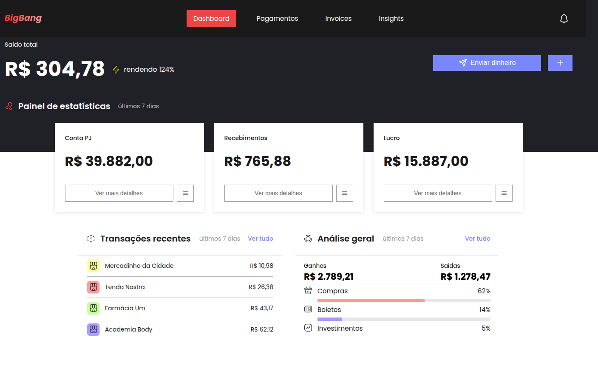
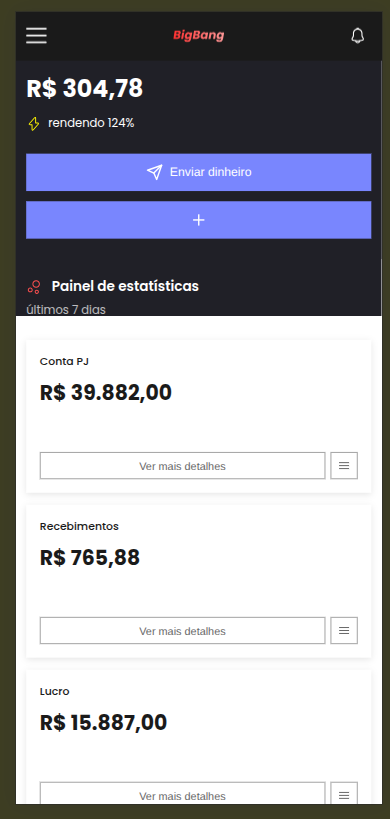

# BigBang Dashboard

Dashboard financeiro que funciona bem em celular, tablet e computador. Mostra informações sobre saldo, ganhos, gastos, transações recentes e análise de categorias de forma clara e fácil de entender.

## 📸 Preview

### Desktop


### Mobile


## 🛠️ Tecnologias Utilizadas

- **Vue 3** - Biblioteca JavaScript para criar interfaces
- **TypeScript** - JavaScript com tipos para evitar erros
- **Vite** - Ferramenta rápida para criar o projeto
- **Axios** - Biblioteca para fazer requisições à API
- **CSS3** - Estilos e cores do projeto
- **Vitest** - Ferramenta para testar o código

## 📦 Como Instalar Dependências

Primeiro, você precisa ter o [Node.js](https://nodejs.org/) instalado no seu computador (versão 18 ou mais nova).

```bash
# Copiar o projeto do GitHub
git clone https://github.com/wsadf/bigbang.git

# Entrar na pasta do projeto
cd bigbang

# Instalar as bibliotecas necessárias
npm install
```

## 🚀 Como Rodar o Projeto Localmente

Depois de instalar as dependências, você pode abrir o projeto no navegador:

```bash
# Iniciar o projeto
npm run dev
```

O projeto vai abrir automaticamente em `http://localhost:3000` no seu navegador.

### Outros comandos úteis:

```bash
# Criar versão para produção
npm run build

# Ver como ficará a versão de produção
npm run preview

# Verificar se há erros no código
npm run type-check

# Rodar os testes
npm run test
```

## 🌐 Deploy

Acesse o projeto online: [https://bigbang-gamma.vercel.app/](https://bigbang-gamma.vercel.app/) (Ctrl+Click ou Cmd+Click para abrir em nova guia)

## 🎯 Decisões Técnicas Tomadas

### Organização do Código
- **Componentes Vue 3**: Escolhido para organizar melhor o código e facilitar a manutenção
- **TypeScript**: Usado para evitar erros e facilitar o desenvolvimento
- **Pastas organizadas**: Cada tipo de arquivo fica em sua pasta (componentes, serviços, estilos, etc)

### Performance
- **Carregamento sob demanda**: Componentes grandes só são carregados quando necessário
- **Código dividido**: O projeto é dividido em partes menores para carregar mais rápido
- **Otimizações**: Código minificado e otimizado para funcionar mais rápido

### Acessibilidade
- **Labels descritivos**: Todos os botões e links têm descrições para leitores de tela
- **Navegação por teclado**: É possível usar o projeto apenas com o teclado
- **Elementos semânticos**: Uso de tags HTML corretas para melhor compreensão

### Responsividade
- **Design mobile primeiro**: O projeto foi pensado primeiro para celular
- **Tamanhos de tela**: Funciona bem em celular (480px), tablet (768px) e computador (1024px+)
- **Menu hambúrguer**: Menu especial para telas pequenas

### Estilos
- **Variáveis CSS**: Cores e tamanhos definidos em um só lugar para facilitar mudanças
- **Estilos isolados**: Cada componente tem seus próprios estilos sem conflitar com outros
- **Design consistente**: Cores, espaçamentos e componentes seguem um padrão

### Tratamento de Erros
- **Tentativas automáticas**: Se uma requisição falhar, o sistema tenta novamente automaticamente
- **Mensagens claras**: Quando algo dá errado, o usuário vê uma mensagem explicativa
- **Validação de dados**: Os dados recebidos são verificados antes de serem usados

## 🔮 Melhorias Futuras

- [ ] Adicionar mais testes automatizados
- [ ] Testes de ponta a ponta (E2E)
- [ ] Guardar dados em cache para carregar mais rápido
- [ ] Adicionar modo escuro/claro
- [ ] Filtros e ordenação nas transações
- [ ] Gráficos interativos para visualizar os dados
- [ ] Notificações em tempo real
- [ ] Suporte para diferentes moedas
- [ ] Exportar relatórios em PDF ou CSV
- [ ] Sistema de login de usuários
- [ ] Transformar em aplicativo (PWA)
- [ ] Suporte para outros idiomas

## 📁 Estrutura do Projeto

```
src/
├── components/          # Componentes da interface
│   ├── shared/         # Componentes que são usados em vários lugares
│   └── __tests__/      # Testes dos componentes
├── services/           # Código que se comunica com a API
│   └── __tests__/      # Testes dos serviços
├── assets/             # Arquivos estáticos
│   ├── icons/          # Ícones
│   ├── images/         # Imagens
│   └── styles/         # Estilos globais
├── types/              # Definições de tipos TypeScript
└── utils/              # Funções auxiliares
```
